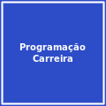
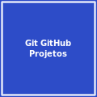
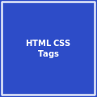
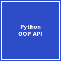

# Matheus Camargo (aka Rhogar Darkmor) 👨‍💻

**Desenvolvedor em Formação | Graduando em Sistemas de Informação**  
*Apaixonado por tecnologia e soluções criativas em transição de carreira*

---

## 💻 Sobre Mim

Sou um entusiasta de tecnologia em transição de carreira, migrando da área de vigilância para desenvolvimento de software. Com experiência anterior como analista de dados e empreendedor, trago uma visão prática e resolução creativa de problemas. Atualmente foco em me especializar em programação através de estudos contínuos e projetos práticos.

- 🎓 **Eterno estudante de Programação**
- 📚 **Estudante dedicado** de Java e Python desde 2018
- ⚡ **Entusiasta** de metodologias ágeis e trabalho em equipe
- 🛠️ **Usuário proficiente** de Visual Studio Code e ferramentas modernas
- 🌱 **Estudando atualmente:** Python, Java, HTML, CSS, JavaScript e inglês

---

## 🛠️ Stack Tecnológica

### Linguagens de Programação

### Bancos de Dados

### Ferramentas & Tecnologias

---

## 📚 Formações e Certificados

### 🏆 Formação Alura - Concluídas
- **Formação Iniciante em Programação** - Concluída em 20/08/2025
- **Formação Python com Orientação a Objetos** - Concluída em 05/09/2025

### 📘 Cursos Concluídos
- Começando em Programação: carreira e primeiros passos
- HTML e CSS: Classes, posicionamento e Flexbox
- Python: aplicando a Orientação a Objetos
- Git e GitHub: compartilhando e colaborando em projetos
- Lógica de programação: explore funções e listas
- Python: avance na Orientação a Objetos e consuma API
- Git e GitHub: dominando controle de versão de código
- Lógica de programação: mergulhe em programação com JavaScript
- Python: crie a sua primeira aplicação
- HTML e CSS: ambientes de desenvolvimento, estrutura de arquivos e tags
- Lógica de programação: praticando com desafios
- String em Python: extraindo informações de uma URL

## Cursos concluidos

  
  
  
  
  
  
  
  
  
  
  
  
  
  
  

---

## 🗺️ Minha Jornada

### 🎯 2019
- **📊 Analista de Dados** na Xerox Comércio e Indústria Ltda
- *Atuei na análise e processamento de dados, desenvolvendo habilidades em organização e resolução de problemas*

### 🔄 2020
- **🚧 Desligamento** devido à pandemia
- **🍔 Abertura de hamburgueria** (empreendimento próprio)
- *Desenvolvi habilidades em gestão, atendimento ao cliente e resiliência empresarial*

### 🏥 2023
- **❤️ Problemas de saúde** que levaram ao fechamento do negócio
- **⏸️ Afastamento** de quase um ano para recuperação
- *Período de reflexão e decisão pela transição de carreira*

### 👮 2024
- **🔒 Atuação como vigilante**
- **🎓 Manutenção do foco** em estudos de programação e inglês
- *Dedicação ao desenvolvimento de habilidades técnicas para transição de carreira*

### 🚀 2025 (Atualmente)
- **🔍 Buscando oportunidade na área de programação**
- 📚 **Estudando continuamente** programação e inglês
- 💼 **Preparado para transição de carreira**
- *Foco em desenvolvimento Back-end com Python e Java*

---

## 📊 Estatísticas do GitHub

| Estatística | Valor |
|-------------|-------|
| 📦 Repositórios Públicos | 8 |
| 📝 Commits | 37 |
| 👥 Seguidores | o |
| 👣 Seguindo | o |

---

## 🌟 Projetos em Destaque

### 🐉 Drakkar - Proxy Viewer & Stream Simulator

Ferramenta Python avançada para teste e simulação de visualizações em streams usando proxies. Desenvolvido com foco em automação web e comportamento realista.

**Tecnologias:** `Python` `Selenium` `Web Scraping` `Multi-threading` `Tkinter/PyQt`  
**Features:** Validação de proxies, simulação realista, interface gráfica, extração automática

---

### Outros Projetos

*Mais projetos em desenvolvimento...*

---

## 🌐 Conecte-se Comigo

---

## 🎯 Objetivo Atual

> *"Em transição de carreira para a área de desenvolvimento, buscando minha primeira oportunidade como programador enquanto continuo me especializando através de estudos contínuos e projetos práticos. Aberto a oportunidades júnior ou estágio em desenvolvimento Back-end com Python ou Java."*

---

*"A persistência é o caminho do êxito." - Charles Chaplin*

